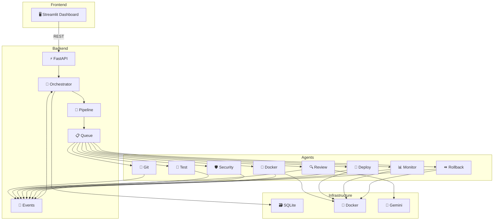
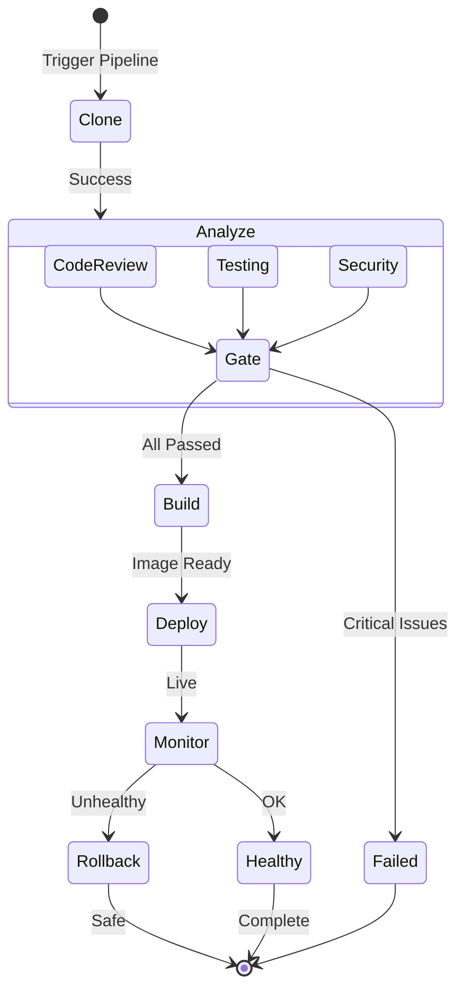

<div align="center">

# 🚀 ApexDeploy

### Autonomous Git-to-Cloud Resilience Engineer

*AI-Powered Multi-Agent DevOps Platform*

[](https://python.org)
[](https://google.github.io/adk-docs/)
[](https://fastapi.tiangolo.com)
[](https://docker.com)
[](LICENSE)

---

**ApexDeploy** is a production-grade, AI-powered Multi-Agent DevOps platform that autonomously manages the entire software deployment lifecycle — from reading Git repositories to monitoring deployed applications and automatically rolling back failed deployments.

[Features](#-features) •
[Architecture](#-architecture) •
[Quick Start](#-quick-start) •
[Agents](#-agents) •
[Documentation](#-documentation)

</div>

---

## ✨ Features

| Feature | Description |
|---------|------------|
| 🤖 **Multi-Agent AI** | 8 specialized agents powered by Google ADK & Gemini |
| 🔀 **Git Integration** | Clone repos, analyze commits, detect languages |
| 🔍 **Code Review** | AI-powered code analysis with complexity & smell detection |
| 🧪 **Auto Testing** | Detects and runs pytest, npm test, mvn test automatically |
| 🛡️ **Security Scanning** | Bandit, dependency scanning, secret detection |
| 🐳 **Docker Build** | Auto-generates Dockerfiles and builds images |
| 🚀 **Local Deployment** | Deploys to local Docker with adapter pattern for multi-cloud |
| 📊 **Health Monitoring** | CPU, memory, HTTP, latency, container status tracking |
| ⏪ **Auto Rollback** | Detects unhealthy deployments and rolls back automatically |
| 📡 **Event-Driven** | Pub/sub event bus for agent communication |
| 🧠 **Agent Memory** | Agents learn from previous pipeline executions |
| 📋 **Task Queue** | Enterprise-grade task scheduling and execution |
| 🖥️ **Dashboard** | Real-time Streamlit dashboard with Plotly charts |
| 🔌 **Plugin System** | Dynamic plugin architecture for extensibility |
| 📈 **Telemetry** | Performance metrics and execution traces |
| 🔧 **MCP Integration** | Model Context Protocol for tool interfaces |

---

## 🏗️ Architecture

### System Overview



### Pipeline Flow



---

## 🚀 Quick Start

### Prerequisites

- Python 3.12+
- Docker Desktop
- Google Gemini API Key

### Installation

```bash
# Clone the repository
git clone https://github.com/your-org/apexdeploy.git
cd apexdeploy

# Create virtual environment
python -m venv .venv
source .venv/bin/activate  # Linux/Mac
# .venv\Scripts\activate   # Windows

# Install dependencies
pip install -r requirements.txt

# Configure environment
cp .env.example .env
# Edit .env with your GOOGLE_API_KEY
```

### Run Locally

```bash
# Start FastAPI backend
uvicorn src.main:app --reload --port 8000

# Start Streamlit dashboard (new terminal)
streamlit run dashboard/app.py
```

### Run with Docker Compose

```bash
docker compose up --build
```

**Access:**
- 🖥️ Dashboard: http://localhost:8501
- ⚡ API Docs: http://localhost:8000/docs
- ❤️ Health: http://localhost:8000/api/health

---

## 🤖 Agents

| Agent | Role | Tools |
|-------|------|-------|
| 📂 **Git Agent** | Clone repos, read commits, detect language | Git MCP, GitHub MCP |
| 🔍 **Code Review Agent** | Analyze quality, complexity, code smells | Filesystem MCP, Gemini |
| 🧪 **Testing Agent** | Auto-detect & run test suites | Terminal MCP |
| 🛡️ **Security Agent** | Bandit, secrets, dependency scanning | Terminal MCP, Filesystem MCP |
| 🐳 **Docker Agent** | Generate Dockerfiles, build images | Docker SDK |
| 🚀 **Deployment Agent** | Deploy via adapter pattern (local/cloud) | Docker SDK |
| 📊 **Monitoring Agent** | CPU, memory, HTTP health, latency | psutil, Docker SDK |
| ⏪ **Rollback Agent** | Auto-detect & rollback failed deployments | Docker SDK |

---

## 📁 Project Structure

```
ApexDeploy/
├── src/                    # Backend source code
│   ├── agents/             # 8 specialized agents
│   ├── core/               # Base agent, orchestrator, registry
│   ├── pipeline/           # Pipeline runner & state machine
│   ├── deployment/         # Deployment adapters (local/cloud)
│   ├── docker/             # Docker client, builder, runner
│   ├── monitoring/         # CPU, memory, health monitors
│   ├── llm/                # Gemini client & prompts
│   ├── memory/             # Agent memory system
│   ├── events/             # Pub/sub event bus
│   ├── state/              # Agent & workflow state
│   ├── queue/              # Task queue & workers
│   ├── telemetry/          # Metrics & traces
│   ├── plugins/            # Plugin architecture
│   ├── mcp/                # MCP server wrappers
│   ├── api/                # FastAPI routes & schemas
│   ├── db/                 # SQLite database layer
│   ├── services/           # Business logic services
│   └── utils/              # Shared utilities
├── dashboard/              # Streamlit UI
├── artifacts/              # Generated agent outputs
├── workspaces/             # Cloned repositories
├── tests/                  # Unit & integration tests
├── docs/                   # Documentation & diagrams
├── data/                   # Runtime database
└── logs/                   # Application logs
```

---

## 📖 Documentation

| Document | Description |
|----------|-------------|
| [Architecture](docs/architecture.md) | System architecture deep-dive |
| [Installation](docs/installation.md) | Detailed installation guide |
| [Agents](docs/agents.md) | Agent reference & API |

---

## 🛠️ Tech Stack

| Layer | Technology |
|-------|-----------|
| Agent Framework | Google ADK |
| LLM | Gemini |
| Backend | FastAPI |
| Dashboard | Streamlit + Plotly |
| Database | SQLite |
| Containerization | Docker |
| Tool Protocol | MCP |
| Security | Bandit |
| Testing | pytest |
| Monitoring | psutil |

---

## 📜 License

This project is licensed under the MIT License — see the [LICENSE](LICENSE) file for details.

---

<div align="center">

**Built for the Kaggle 5-Day AI Agents Intensive Vibe Coding Capstone Project**

⭐ Star this project if you find it useful!

</div>
