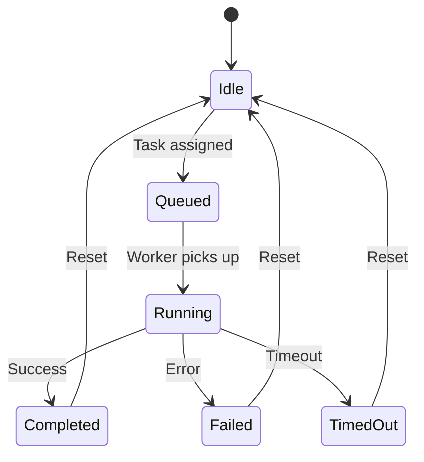

# ApexDeploy — Agent Reference

## Overview

ApexDeploy uses **8 specialized agents** orchestrated by Google ADK. Each agent has a single responsibility and communicates through the Event Bus.

---

## Agent Lifecycle

---

## Agents

### 📂 Git Agent
**Purpose**: Clone repositories, read commits, detect project language, generate metadata.

| Property | Value |
|----------|-------|
| MCP Tools | Git MCP, GitHub MCP |
| Input | Repository URL, branch |
| Output | `artifacts/git/` — repo metadata JSON |
| Events | `REPO_CLONED`, `REPO_ANALYZED` |

---

### 🔍 Code Review Agent
**Purpose**: Analyze source code quality, detect complexity, find code smells, generate suggestions.

| Property | Value |
|----------|-------|
| Tools | Filesystem MCP, Gemini |
| Input | Repository local path |
| Output | `artifacts/code_review/` — review report |
| Events | `CODE_REVIEWED` |

---

### 🧪 Testing Agent
**Purpose**: Auto-detect test framework (pytest/npm/mvn), run tests, collect results.

| Property | Value |
|----------|-------|
| Tools | Terminal MCP |
| Input | Repository local path, detected language |
| Output | `artifacts/testing/` — test results, coverage |
| Events | `TESTS_COMPLETED` |

---

### 🛡️ Security Agent
**Purpose**: Run Bandit, scan dependencies, detect secrets, review configuration.

| Property | Value |
|----------|-------|
| Tools | Terminal MCP, Filesystem MCP |
| Input | Repository local path |
| Output | `artifacts/security/` — security report |
| Events | `SECURITY_SCANNED` |

---

### 🐳 Docker Agent
**Purpose**: Generate Dockerfile, build Docker images, manage containers.

| Property | Value |
|----------|-------|
| Tools | Docker SDK |
| Input | Repository path, language, config |
| Output | `artifacts/docker/` — build logs, Dockerfile |
| Events | `IMAGE_BUILT`, `CONTAINER_STARTED` |

---

### 🚀 Deployment Agent
**Purpose**: Deploy containers using the adapter pattern (local Docker, future cloud).

| Property | Value |
|----------|-------|
| Tools | Docker SDK, Deployment Adapters |
| Input | Docker image, deployment config |
| Output | `artifacts/deployments/` — deployment record |
| Events | `DEPLOYMENT_STARTED`, `DEPLOYMENT_COMPLETED` |

---

### 📊 Monitoring Agent
**Purpose**: Monitor CPU, memory, HTTP health, latency, container status.

| Property | Value |
|----------|-------|
| Tools | psutil, Docker SDK |
| Input | Container ID, health check config |
| Output | `artifacts/monitoring/` — metrics snapshots |
| Events | `HEALTH_CHECK`, `UNHEALTHY_DETECTED` |

---

### ⏪ Rollback Agent
**Purpose**: Automatically roll back failed deployments to the last healthy version.

| Property | Value |
|----------|-------|
| Tools | Docker SDK |
| Input | Deployment ID, previous image |
| Output | `artifacts/rollback/` — rollback report |
| Events | `ROLLBACK_TRIGGERED`, `ROLLBACK_COMPLETED` |
