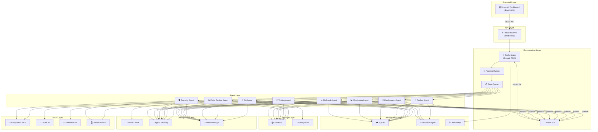
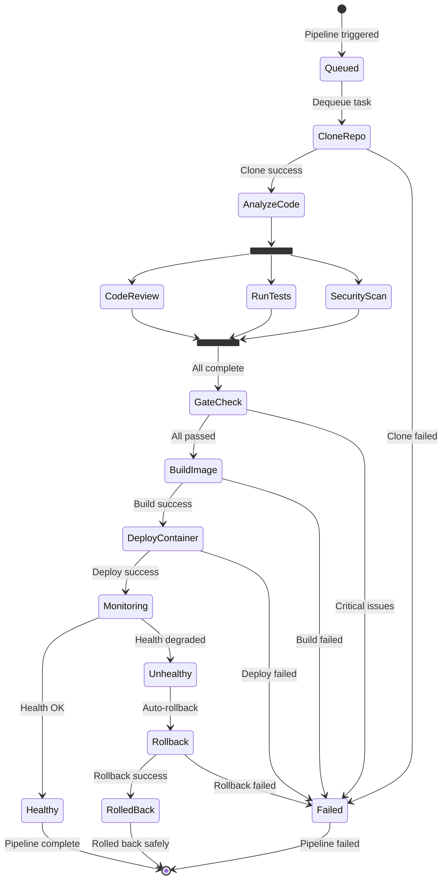
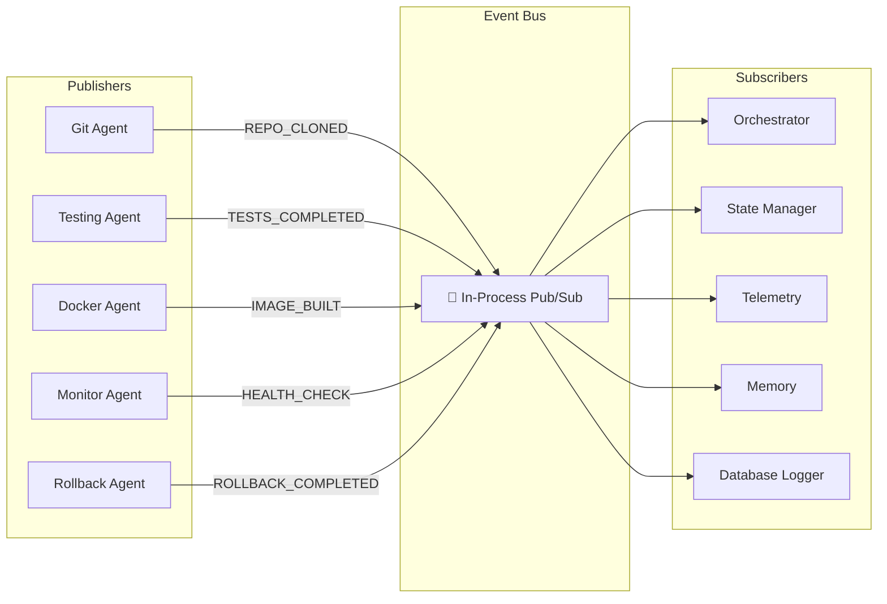

# ApexDeploy — Architecture

## System Architecture

ApexDeploy is built as a **multi-agent AI platform** using Google ADK, where 8 specialized agents collaborate through an event-driven pipeline to automate the full software deployment lifecycle.

### High-Level Overview

---

## Layers

### 1. Frontend Layer
**Streamlit Dashboard** — provides a real-time UI with 10 pages: Overview, Repositories, Pipeline, Agents, Docker, Monitoring, Security, Reports, Logs, and Settings. Communicates with the backend via REST API calls.

### 2. API Layer
**FastAPI Server** — exposes RESTful endpoints for pipeline management, agent control, deployment operations, monitoring data, and report generation. Provides auto-generated OpenAPI docs.

### 3. Orchestration Layer
- **Orchestrator (Google ADK)** — the central brain that coordinates all agents
- **Pipeline Runner** — executes pipeline stages in sequence/parallel
- **Event Bus** — pub/sub system for decoupled agent communication
- **Task Queue** — priority queue for scheduling agent work

### 4. Agent Layer
Eight specialized agents, each with a single responsibility:
- **Git Agent** → Repository operations
- **Code Review Agent** → Code quality analysis
- **Testing Agent** → Test suite execution
- **Security Agent** → Vulnerability scanning
- **Docker Agent** → Image build & management
- **Deployment Agent** → Container deployment
- **Monitoring Agent** → Health monitoring
- **Rollback Agent** → Failure recovery

### 5. Intelligence Layer
- **Gemini Client** → Centralized LLM integration
- **Agent Memory** → Cross-pipeline learning
- **State Manager** → Real-time agent status

### 6. MCP Layer
Model Context Protocol wrappers providing standardized tool interfaces for filesystem, Git, GitHub, and terminal operations.

### 7. Infrastructure Layer
- **SQLite** → Persistent storage for all data
- **Docker Engine** → Container lifecycle management
- **Telemetry** → Performance metrics and traces

### 8. Storage Layer
- **artifacts/** → Organized agent outputs
- **workspaces/** → Cloned repositories

---

## Database Schema

See [001_initial.sql](../src/db/migrations/001_initial.sql) for the complete schema with 9 tables:
- `repositories` — tracked Git repositories
- `pipeline_runs` — pipeline execution records
- `agent_results` — per-agent output data
- `deployments` — container deployment records
- `monitoring_snapshots` — health check data
- `security_findings` — vulnerability records
- `rollback_events` — rollback history
- `agent_memory` — agent learning data
- `event_log` — event audit trail

---

## Pipeline Flow

---

## Event System

