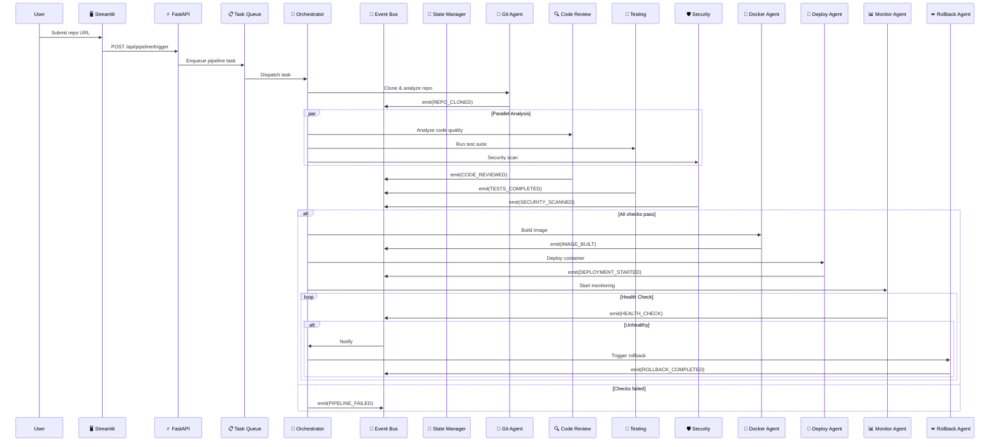

# Agent Communication Diagram

```mermaid
sequenceDiagram
    participant User
    participant Dashboard as 🖥️ Streamlit
    participant API as ⚡ FastAPI
    participant Queue as 📋 Task Queue
    participant Orc as 🧠 Orchestrator
    participant Bus as 📡 Event Bus
    participant State as 📌 State Manager
    participant Git as 📂 Git Agent
    participant Review as 🔍 Code Review
    participant Test as 🧪 Testing
    participant Sec as 🛡️ Security
    participant Docker as 🐳 Docker Agent
    participant Deploy as 🚀 Deploy Agent
    participant Mon as 📊 Monitor Agent
    participant Roll as ⏪ Rollback Agent

    User->>Dashboard: Submit repo URL
    Dashboard->>API: POST /api/pipeline/trigger
    API->>Queue: Enqueue pipeline task
    Queue->>Orc: Dispatch task

    Orc->>Git: Clone & analyze repo
    Git->>Bus: emit(REPO_CLONED)

    par Parallel Analysis
        Orc->>Review: Analyze code quality
        Orc->>Test: Run test suite
        Orc->>Sec: Security scan
    end

    Review->>Bus: emit(CODE_REVIEWED)
    Test->>Bus: emit(TESTS_COMPLETED)
    Sec->>Bus: emit(SECURITY_SCANNED)

    alt All checks pass
        Orc->>Docker: Build image
        Docker->>Bus: emit(IMAGE_BUILT)
        Orc->>Deploy: Deploy container
        Deploy->>Bus: emit(DEPLOYMENT_STARTED)
        Orc->>Mon: Start monitoring

        loop Health Check
            Mon->>Bus: emit(HEALTH_CHECK)
            alt Unhealthy
                Bus->>Orc: Notify
                Orc->>Roll: Trigger rollback
                Roll->>Bus: emit(ROLLBACK_COMPLETED)
            end
        end
    else Checks failed
        Orc->>Bus: emit(PIPELINE_FAILED)
    end
```
