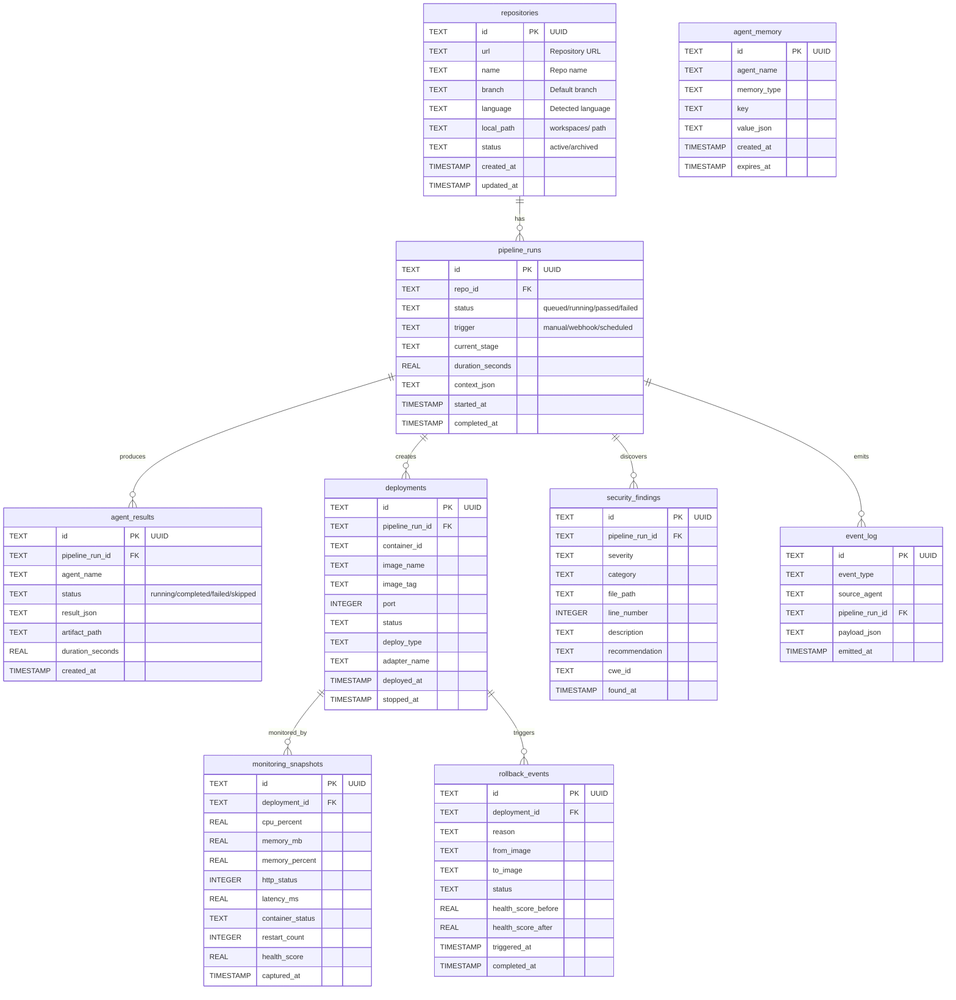

# Database ERD Diagram

```mermaid
erDiagram
    repositories {
        TEXT id PK "UUID"
        TEXT url "Repository URL"
        TEXT name "Repo name"
        TEXT branch "Default branch"
        TEXT language "Detected language"
        TEXT local_path "workspaces/ path"
        TEXT status "active/archived"
        TIMESTAMP created_at
        TIMESTAMP updated_at
    }

    pipeline_runs {
        TEXT id PK "UUID"
        TEXT repo_id FK
        TEXT status "queued/running/passed/failed"
        TEXT trigger "manual/webhook/scheduled"
        TEXT current_stage
        REAL duration_seconds
        TEXT context_json
        TIMESTAMP started_at
        TIMESTAMP completed_at
    }

    agent_results {
        TEXT id PK "UUID"
        TEXT pipeline_run_id FK
        TEXT agent_name
        TEXT status "running/completed/failed/skipped"
        TEXT result_json
        TEXT artifact_path
        REAL duration_seconds
        TIMESTAMP created_at
    }

    deployments {
        TEXT id PK "UUID"
        TEXT pipeline_run_id FK
        TEXT container_id
        TEXT image_name
        TEXT image_tag
        INTEGER port
        TEXT status
        TEXT deploy_type
        TEXT adapter_name
        TIMESTAMP deployed_at
        TIMESTAMP stopped_at
    }

    monitoring_snapshots {
        TEXT id PK "UUID"
        TEXT deployment_id FK
        REAL cpu_percent
        REAL memory_mb
        REAL memory_percent
        INTEGER http_status
        REAL latency_ms
        TEXT container_status
        INTEGER restart_count
        REAL health_score
        TIMESTAMP captured_at
    }

    security_findings {
        TEXT id PK "UUID"
        TEXT pipeline_run_id FK
        TEXT severity
        TEXT category
        TEXT file_path
        INTEGER line_number
        TEXT description
        TEXT recommendation
        TEXT cwe_id
        TIMESTAMP found_at
    }

    rollback_events {
        TEXT id PK "UUID"
        TEXT deployment_id FK
        TEXT reason
        TEXT from_image
        TEXT to_image
        TEXT status
        REAL health_score_before
        REAL health_score_after
        TIMESTAMP triggered_at
        TIMESTAMP completed_at
    }

    agent_memory {
        TEXT id PK "UUID"
        TEXT agent_name
        TEXT memory_type
        TEXT key
        TEXT value_json
        TIMESTAMP created_at
        TIMESTAMP expires_at
    }

    event_log {
        TEXT id PK "UUID"
        TEXT event_type
        TEXT source_agent
        TEXT pipeline_run_id FK
        TEXT payload_json
        TIMESTAMP emitted_at
    }

    repositories ||--o{ pipeline_runs : "has"
    pipeline_runs ||--o{ agent_results : "produces"
    pipeline_runs ||--o{ deployments : "creates"
    pipeline_runs ||--o{ security_findings : "discovers"
    pipeline_runs ||--o{ event_log : "emits"
    deployments ||--o{ monitoring_snapshots : "monitored_by"
    deployments ||--o{ rollback_events : "triggers"
```
