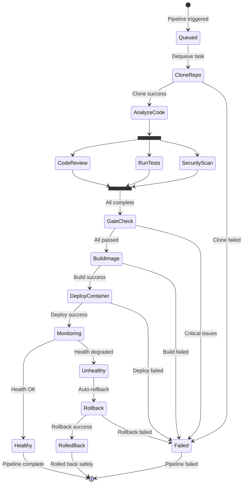

# Pipeline Flow Diagram

```mermaid
stateDiagram-v2
    [*] --> Queued: Pipeline triggered
    Queued --> CloneRepo: Dequeue task

    CloneRepo --> AnalyzeCode: Clone success
    CloneRepo --> Failed: Clone failed

    state parallel_analysis <<fork>>
    AnalyzeCode --> parallel_analysis

    parallel_analysis --> CodeReview
    parallel_analysis --> RunTests
    parallel_analysis --> SecurityScan

    state parallel_join <<join>>
    CodeReview --> parallel_join
    RunTests --> parallel_join
    SecurityScan --> parallel_join

    parallel_join --> GateCheck: All complete

    GateCheck --> BuildImage: All passed
    GateCheck --> Failed: Critical issues

    BuildImage --> DeployContainer: Build success
    BuildImage --> Failed: Build failed

    DeployContainer --> Monitoring: Deploy success
    DeployContainer --> Failed: Deploy failed

    Monitoring --> Healthy: Health OK
    Monitoring --> Unhealthy: Health degraded

    Unhealthy --> Rollback: Auto-rollback
    Rollback --> RolledBack: Rollback success
    Rollback --> Failed: Rollback failed

    Healthy --> [*]: Pipeline complete
    RolledBack --> [*]: Rolled back safely
    Failed --> [*]: Pipeline failed
```
