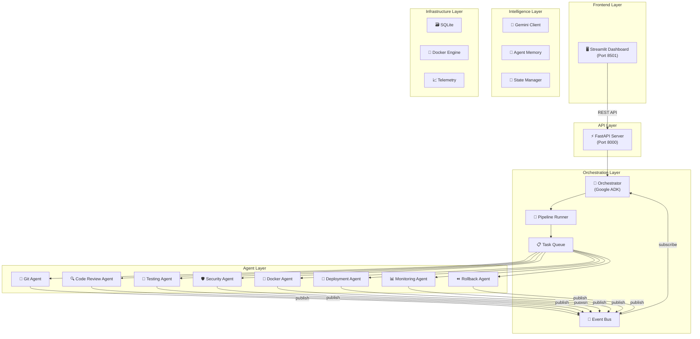

# System Architecture Diagram

```mermaid
graph TB
    subgraph "Frontend Layer"
        ST["🖥️ Streamlit Dashboard<br/>(Port 8501)"]
    end

    subgraph "API Layer"
        FA["⚡ FastAPI Server<br/>(Port 8000)"]
    end

    subgraph "Orchestration Layer"
        ORC["🧠 Orchestrator<br/>(Google ADK)"]
        PR["🔄 Pipeline Runner"]
        EV["📡 Event Bus"]
        TQ["📋 Task Queue"]
    end

    subgraph "Agent Layer"
        GA["📂 Git Agent"]
        CRA["🔍 Code Review Agent"]
        TA["🧪 Testing Agent"]
        SA["🛡️ Security Agent"]
        DA["🐳 Docker Agent"]
        DEP["🚀 Deployment Agent"]
        MA["📊 Monitoring Agent"]
        RA["⏪ Rollback Agent"]
    end

    subgraph "Intelligence Layer"
        LLM["🤖 Gemini Client"]
        MEM["🧠 Agent Memory"]
        STATE["📌 State Manager"]
    end

    subgraph "Infrastructure Layer"
        DB["🗃️ SQLite"]
        DOCKER["🐳 Docker Engine"]
        TEL["📈 Telemetry"]
    end

    ST -->|REST API| FA
    FA --> ORC
    ORC --> PR
    PR --> TQ
    TQ --> GA & CRA & TA & SA & DA & DEP & MA & RA
    GA & CRA & TA & SA & DA & DEP & MA & RA -->|publish| EV
    EV -->|subscribe| ORC
```
